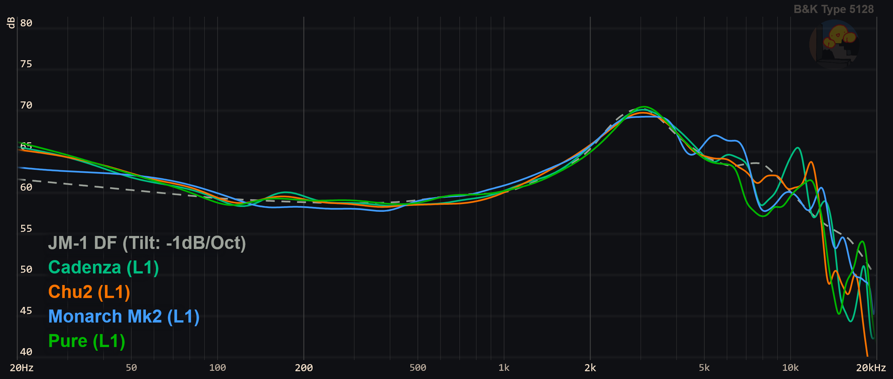
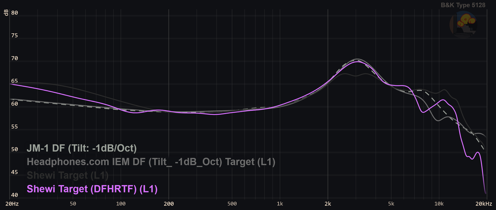
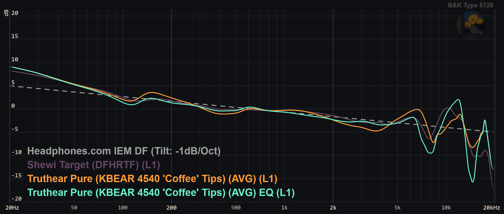

# YetAnotherAudioProject

Yet another nerd and personnal audio project to find the perfect sound with IEMs (In-Ear-Monitors, or fancy earphones), useful to nobody but me (_‘ω‘ _)!!  
See it as an expose or proof of concept.

Required knowledge/Context to understand any of this:

- https://headphones.com/blogs/features/a-reviewers-guide-to-understanding-graphs-the-b-k-5128-edition
- https://headphones.com/blogs/features/diffuse-field

In simple terms, hopefully, the goal of this project is to:

1.  Find what is the anatomically correct/best sound signature with IEMs (aka. frequency response) that should come to _my_ eardrums, and NOT the population average, using industry standard measurements.  
    This is not applicable with headphones as the pinna's transfer function is bypassed. Translation: the sound of the earphone has to preshot how the outer-ear (mine in this case) changes the sound, in order for the individual to have a good sound subjectively.  
    The whole point of this project is to estimate its contribution (usually from 3 kHz to 10 kHz..and above ?), so it can be simulated in the final frequency response.

2.  Find the IEM with **potentially** the closest sound to that ideal.

Technical explanation:  
Each IEM in the "phones" folder has been equalized as coherently as possible to my DFHRTF (Diffuse Field Head Related Transfer Function), so I can't hear any peaks and dips from a sinesweep, and sounds flat.  
I made sure it follows more or less the preference bounds, so the tilt is coherent (-1dB/ocatve).

It has been done by ear and using 5128 data, so it can't come even close to what a measurement of the HRTF in a diffuse field of a lab can provide. But by averaging, my hope is to dilute HpTF effect (variation in frequency response not related to anatomy but the IEM load), as well as inaccuracies.

However, for that exact reason, a "one-fits-all" target does not exist, even at the individual scale: frequency response varies so much from individual to individual above 10k or less that the idea of single-line adherence becomes really irrelevant.
It is still insteresting to establish, as it
tells what sound signature on average my brain expects to hear.

Bass shelf level is arbitrary to match my current preference.

### Results


Only 4 IEMs have been studied for now. The following target is their average:


(Happy to see that my old stupid target ("Shewi Target") had almost the correct shape at 10k !)

Coeff: 3 from 4 kHz to 17kHz, 1 otherwise  
Data points with a logarithmic distribution, see the target

```
Closest IEMs to Shewi Target (DFHRTF).txt:
1. CrinEar Reference (Standard bore tips) (AVG) with 6769 points
2. Truthear Pure (KBEAR 4540 'Coffee' Tips) (AVG) with 6548 points
3. CrinEar Daybreak (Shortwide tips) S1 (AVG) with 6463 points
4. ZiiGaat x Hangout.Audio Odyssey 2 (AVG) with 6445 points
5. Truthear Pure (Narrow bore tips) (AVG) with 6424 points
6. Letshuoer Cadenza 12 (AVG) with 6407 points
7. Subtonic Storm (AVG) with 6335 points
8. Moondrop Space Travel 2 (AVG) with 6330 points
9. Moondrop Ray DSP (AVG) with 6240 points
10. 7Hz x Crinacle Divine (AVG) with 6231 points
```

According to my very simplified model, the Pure with Coffee tips is supposed to be the second most anatomically adapted sounding IEM. However, a fairly large amount of equalization (changes in the sound) was required to really sound neutral to my ears. This is mainly due to resonance peaks in the treble.



We can conclude one of two things here: 1. no IEM is still "perfect" for my anatomy (excluding CrinEar Reference which I have not tried), OR 2. HpTF effect (changes in sound by the IEM's load unrelated to anatomy) is so important in the treble it's actually impossible to predict which IEM perfectly suits me.
