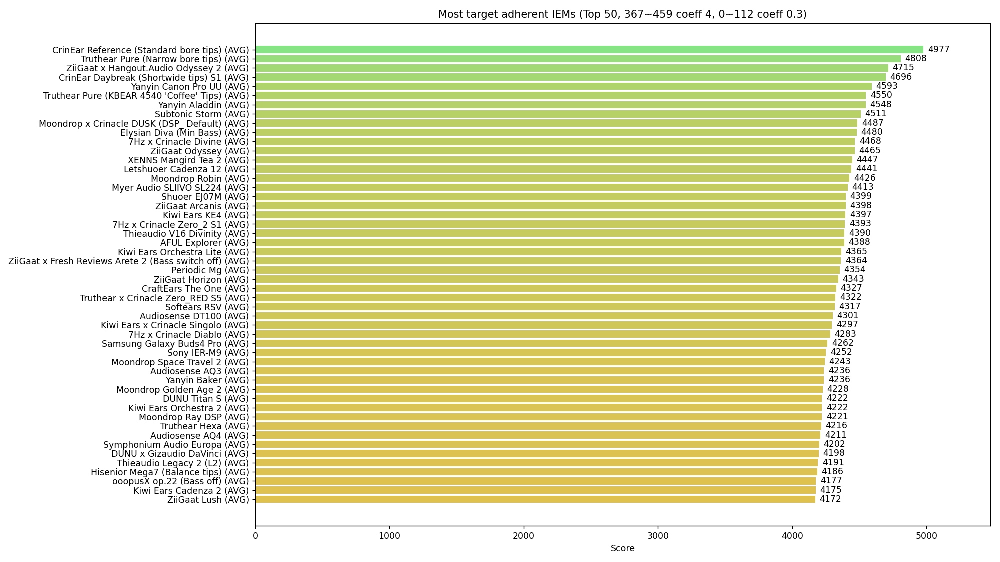
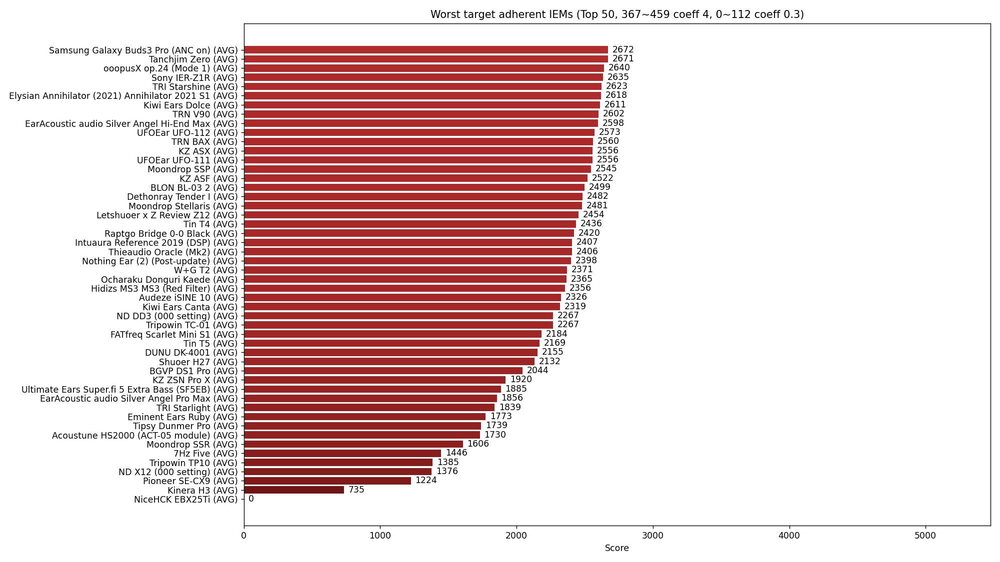
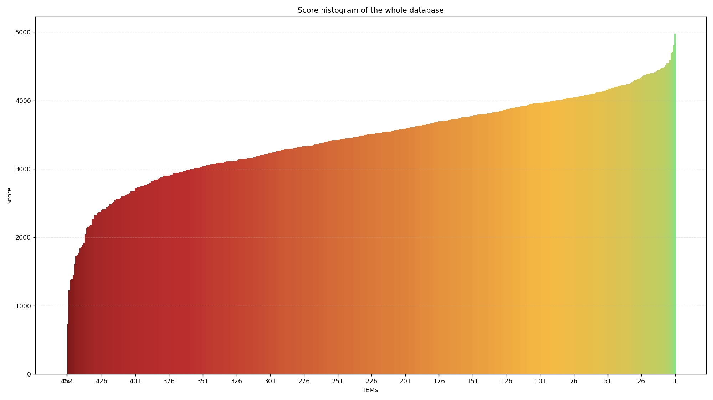

# YetAnotherAudioProject

Yet another nerd and personnal audio project to find the perfect sound with IEMs (In-Ear-Monitors, or fancy earphones), useful to nobody but me (_‘ω‘ _)!!  
See it as an expose or proof of concept.

Required knowledge/Context to understand any of this:

- https://headphones.com/blogs/features/a-reviewers-guide-to-understanding-graphs-the-b-k-5128-edition
- https://headphones.com/blogs/features/diffuse-field

In simple terms, hopefully, the goal of this project is to:

1.  Find what is the anatomically correct/best sound signature with IEMs (aka. frequency response) that should come to _my_ eardrums, and NOT the population average, using industry standard measurements.  
    This is not applicable with headphones as the pinna's transfer function is bypassed. Translation: the sound of the earphone has to preshot how the outer-ear (mine in this case) changes the sound, in order for the individual to have a good sound subjectively.  
    The whole point of this project is to estimate its contribution (usually from 3 kHz to 10 kHz..and above ?), so it can be simulated in the final frequency response.

2.  Find the IEM with **potentially** the closest sound to that ideal.

Technical explanation:  
Each IEM in the "phones" folder has been equalized as coherently as possible to my DFHRTF (Diffuse Field Head Related Transfer Function), so I can't hear any peaks and dips from a sinesweep, and sounds flat.  
I made sure it follows more or less the preference bounds, so the tilt is coherent (-1dB/ocatve).

It has been done by ear and using 5128 data, so it can't come even close to what a measurement of the HRTF in the diffuse field of a lab can provide. But by averaging, my hope is to dilute HpTF effect (variation in frequency response not related to anatomy but the IEM load), as well as inaccuracies.

However, for that exact reason, a "one-fits-all" target does not exist, even at the individual scale: frequency response varies so much from individual to individual above 3k (so between 5128 measurements and on my head here) that the idea of single-line adherence becomes really irrelevant.
It is still insteresting to establish, as it
tells what sound signature on average my brain expects to hear.

Bass shelf level is arbitrary to match my current preference.

### Results

The following target is their average:

(Happy to see that my old stupid target ("Shewi Target") had almost the correct shape at 10k !)

GRAPHS JUST FOR FUN, again target adherence does not tell the full story.  
Truthear Pure with narrow bore tips, while being perfectible in the treble, does sound insanely good on my ears though. I currently do not have other IEMs to test in the top.

Coeff set to reward pinna HRTF adherence and attenuate bass importance (way too much data points).  
Data above 16kHz is ignored in the score calculation.  
Data points have a logarithmic distribution, see the target txt file.

Issue to solve: bass has way too much weight.

